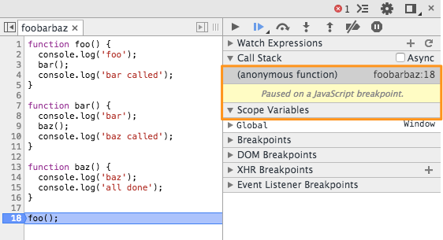
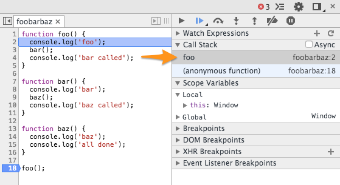
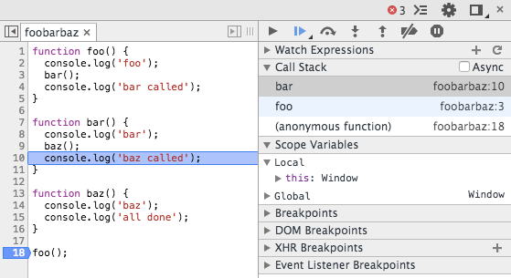
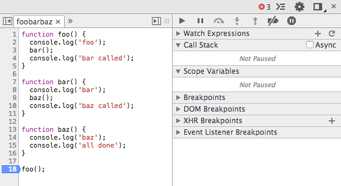
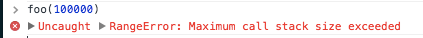

ECMAScript 6 a.k.a. ECMAScript 2015 a.k.a. the new version of JavaScript is
getting closer and closer to ratification, the current goal is to have the new
standard ready in June 2015. This is a big step forward for JavaScript that is
becoming a modern language, suitable for all the uses we need.

If you follow tech news you know about some of these changes:
[classes](http://es6-features.org/#ClassDefinition),
[modules](http://es6-features.org/#SymbolExportImport),
[spread operators](http://es6-features.org/#SpreadOperator)… In this post I will
analyze one less known feature: tail call optimization.

## CS 101: The Stack Frame

Let’s analyze this simple snippet of code:

```js
function foo() {
  console.log("foo");
  bar();
  console.log("bar called");
}

function bar() {
  console.log("bar");
  baz();
  console.log("baz called");
}

function baz() {
  console.log("baz");
  console.log("all done");
}

foo();
```

When we invoke `foo`, a new stack frame is created in memory. A stack frame is
simply a portion of memory where we store some values necessary to execute the
function, for instance local variables, arguments and most importantly the
caller of the function, so when the execution is done the _callee_ can return to
it.

Let’s see this in action using
[Chrome’s debugger](https://developer.chrome.com/devtools/docs/javascript-debugging):



In the orange rectangle, you have the stack frame and also a list of local
variables. It’s not exciting but let’s see what happens when we call `foo`:



A new stack frame gets created. Notice that the other frame is still there, we
will need it later. After `foo` calls `bar` that calls `baz`, we are in this
situation:


Two new stacks are created, one for `bar` and one for `baz`, those stacks are
listed in what is called call stack. The call stack is very useful when you
debug because it tells you the history of your program: which function called
which other function. After `baz` has done its job it returns back to `bar`:



As you can see, the stack frame for `baz` is deleted because we no longer need
it anymore. Every time a function returns, its stack frame gets deleted. After
our program is done, the call stack will be empty:



## Maximum Call Stack Size

Now that you have a general understanding of what stack frame and call stack
are, we can see an error you may encounter while programming.

Imagine you have this function:

```js
function foo(n) {
  if (n === 0) return;
  foo(n - 1);
}
```

If you call `foo` with a positive integer, it will simply call itself decreasing
the number until it reaches zero. This is how the call stack behaves if we
execute `foo(10)`:

`video:https://youtu.be/oorN1hGcgKs`

As you can see, 10 stack frames get created until `n` reaches zero, at which
point the functions begin to return and all the stacks get deleted.

So if `n` is 10, we have 10 stack frames, if `n` is 100, we have 100 frames and
so on. What happens if `n` is 100,000?



As said, every stack frame gets created in memory; unfortunately, a program has
a limited amount of memory assigned, so it’s possible that the call stack
becomes too big. In this case, we have an error and the program crashes.

## Tail Call Optimization

Let’s keep our focus on the previous function. As you can clearly see, the last
thing it does before returning is to call itself. This means that, when the
called function returns, `foo` will do nothing, just immediately return to its
caller.

This kind of code allows a `tail call optimization`. With this optimization, if
the last thing a function does is to call another function, instead of creating
a new stack frame the callee will use the caller function’s frame.

In our case, `foo(n-1)` will simply use `foo(n)`’s frame as will `foo(n-2)` etc.
In the end, `foo(0)` will simply return directly to the main program instead of
going through the entire call stack.

This is not only faster but it requires far less memory: instead of creating
100,000 frames we simply have 1 that gets re-used. So our call to `foo(100000)`
will get executed without exceptions.

If you think it’s unlikely you’ll write code like this, think again. Functional
programming is
[rising in popularity](https://medium.com/@jugoncalves/functional-programming-should-be-your-1-priority-for-2015-47dd4641d6b9)
and makes heavy use of tail calls. One of the reasons it hasn’t been used too
much in JavaScript was exactly the lack of tail call optimization.

Also, many languages are now transpiling to JavaScript. Think of Unreal Engine,
which is a C/C++ program, now
[running in Firefox](https://blog.mozilla.org/blog/2014/03/12/mozilla-and-epic-preview-unreal-engine-4-running-in-firefox/).
Those platforms will benefit from this optimization as it’s already a given for
them.

## Current Implementations

This is the part where we usually blame IE for not supporting the new cool
feature, unfortunately this time we have to blame everyone:

[](<https://kangax.github.io/compat-table/es6/#proper_tail_calls_(tail_call_optimisation)>)

As you can see, only [Babel](https://babeljs.io/) partially supports it. This is
of course about to change in the near future.

If you want to learn more about tail call optimization check the
[ES6 draft](https://people.mozilla.org/~jorendorff/es6-draft.html#sec-tail-position-calls).
